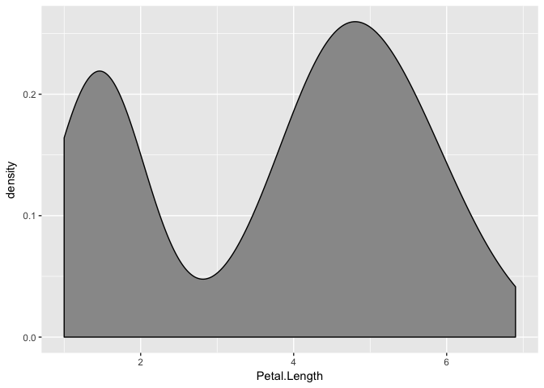
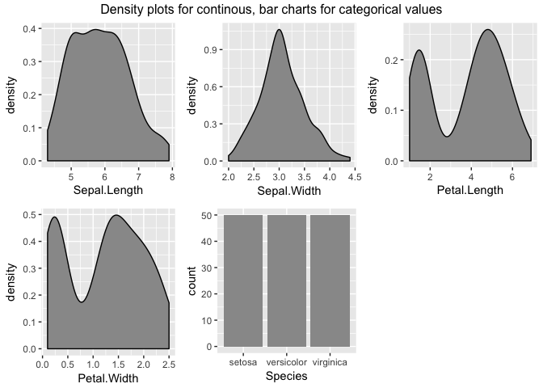
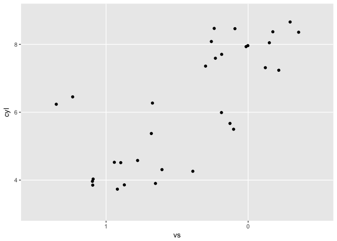
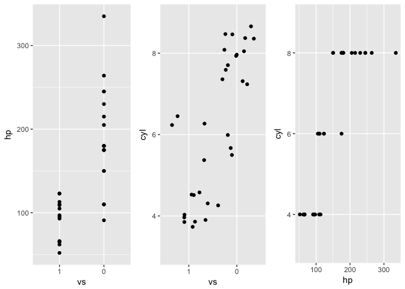
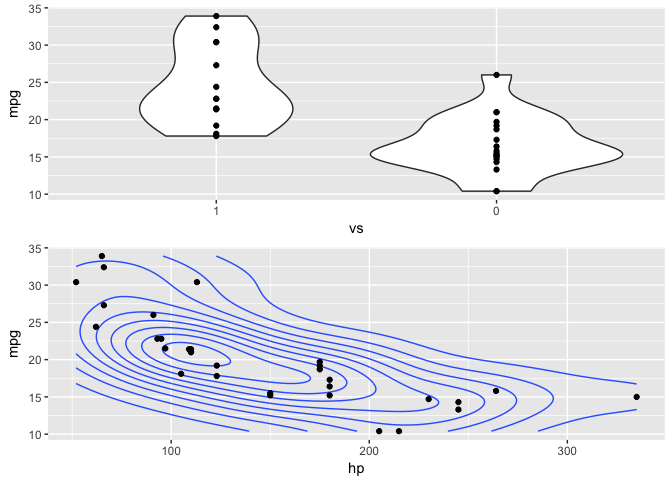
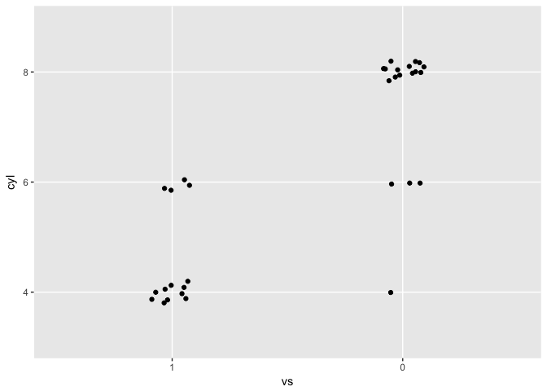
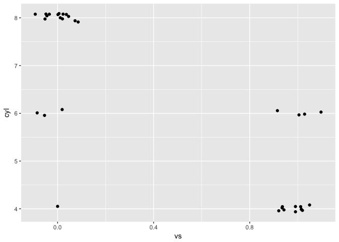
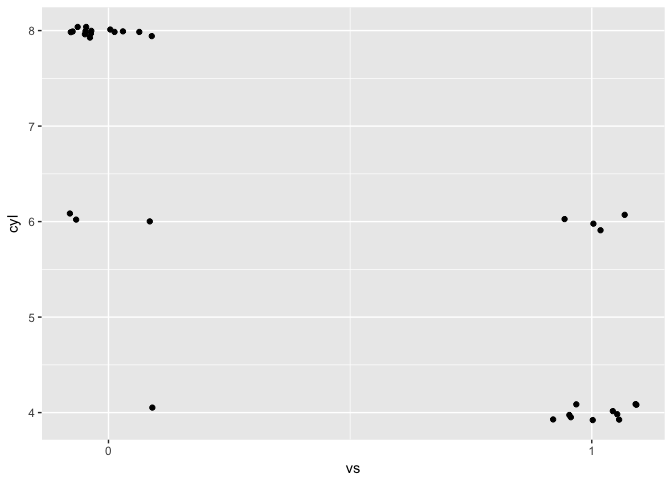
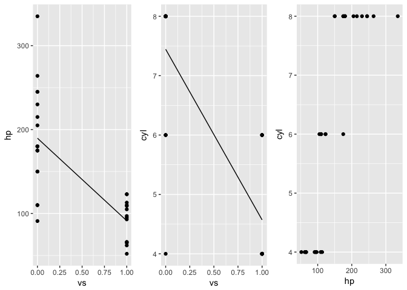

[](https://www.tidyverse.org/life%20cycle/#experimental)
[](https://travis-ci.org/lorenzwalthert/simplificar)
[](https://ci.appveyor.com/project/lorenzwalthert/simplificar)
[](https://codecov.io/github/lorenzwalthert/simplificar?branch=master)

<!-- README.md is generated from 
  README.Rmd. Please edit that file -->
<!-- README.md is generated from README.Rmd. Please edit that file -->

# simplificar

simplificar - for simplify in Spanish - is a high-level API for ggplot2
that enables fast experiments. It is envisioned as a tool for
exploratory analysis early in the cycle of statistical model building
where standardized plots should be available quickly, with few lines of
code. The package takes advantage of the flexible tabular data structure
implemented in the package tibble for handling plots after their
creation.

## Installation

You can install the development version from GitHub.

``` r
# install.packages("remotes")
remotes::install_github("lorenzwalthert/simplificar")
```

## Overview

The package provides two interfaces for creating plots:

  - Low-level interface: The functions `vis_[n]d_[*]()`, e.g.
    `vis_1d_distr()` that let you draw one plot at once. They have an
    argument `aes`, which basically let you specify which aesthetics you
    want to map and how. There are always two versions of low-level
    interfaces: One that outputs the plot to the console (like
    `vis_1d_distr()` and one that writes to a file (e.g.
    `vis_1d_distr_to_file()`). Depending on the classes of the data
    provided, `simplificar` does a dispatch between ggplot geoms,
    e.g. to visualize a distribution, it creates bar plots for
    categorical variables and density plots for continuous data.
  - high-level interface: The function `vis_cols()` let’s you plot
    various plots at once, specifying a `transformer`, that is, a
    function belonging to the low-level interface introduced in the
    first bullet, e.g. `vis_1d_distr()`. You can use tidy selectors.

This is best understood looking at some examples.

## Examples

### High-level interface

Let’s first focus on `vis_cols()`. You can create plots with the
distribution of all variables in a data set as follows:

``` r
library(simplificar)
(plots <- vis_cols(iris, transformer = vis_1d_distr))
#> # A tibble: 5 x 6
#>   data  aes_string   class_string gg       aes       class    
#>   <chr> <chr>        <chr>        <list>   <list>    <list>   
#> 1 iris  Sepal.Length numeric      <S3: gg> <chr [1]> <chr [1]>
#> 2 iris  Sepal.Width  numeric      <S3: gg> <chr [1]> <chr [1]>
#> 3 iris  Petal.Length numeric      <S3: gg> <chr [1]> <chr [1]>
#> 4 iris  Petal.Width  numeric      <S3: gg> <chr [1]> <chr [1]>
#> 5 iris  Species      factor       <S3: gg> <chr [1]> <chr [1]>
```

If visualizations should be written to files, just use the corresponding
low-level transformer (i.e. `vis_1d_distr_to_file`) instead.

By default, all variables are selected. You can use tidy selectors (see
`?tidyselect::vars_select_helpers()`) to only create a few plots.

``` r
vis_cols(iris, contains("Width"))
#> # A tibble: 2 x 6
#>   data  aes_string  class_string gg       aes       class    
#>   <chr> <chr>       <chr>        <list>   <list>    <list>   
#> 1 iris  Sepal.Width numeric      <S3: gg> <chr [1]> <chr [1]>
#> 2 iris  Petal.Width numeric      <S3: gg> <chr [1]> <chr [1]>
```

All plots are stored in the list column `gg`. We use the terminology gg
table to refer to the tabular structure displayed above and raw gg to
refer to a ggplot in the gg list column. You can use dplyr(-like) syntax
to manipulate the gg table, e.g. you can pull out a certain raw gg.
Let’s pull the second last plot that has a numeric aesthetic.

``` r
plots %>%
  dplyr::filter(class == "numeric") %>%
  pull_gg(-2)
```



You can patch different visualizations into one. All but the first
argument passed to `merge_vis()` go into `gridExra::girid.arrange()`.

``` r
plots %>%
  merge_vis(
    top = "Density plots for continous, bar charts for categorical values", 
    nrow = 2
)
```



**Transforming columns**

You can apply arbitrary transformations to one or multiple columns with
`transform_cols()`. Your transformer need to have the vector to
transform as first argument Further arguments to the transformer are
passed at the last position (via `...`). Here, we can use
`readr::parse_factor(x, ...)` for safe factor parsing.

``` r
mtcars_converted  <- mtcars %>%
  transform_cols(c("vs", "am"), transformer = "readr::parse_factor", levels = 1:0) %>%
  transform_cols(c("cyl"), transformer = "readr::parse_factor", levels = c(4, 6, 8))
```

**Internal dispatch for different classes of data**

For ggplot2, it is essential to use the correct class for each variable,
otherwise, the plot may not look as expected. That is why `simplificar`
offers an automatic dispatch layer. Assuming you want to create scatter
plots. You can select the corresponding transformer `vis_2d_point`.
`simplificar` will check if any plot you draw has categorical variables
only. If so, you probably want to use `ggplot2::geom_jitter()` instead
of `ggplot::geom_point()`. `simplificar` will take care of that and
select the geom according to the variable class.

``` r
multiple_vis <- mtcars_converted %>%
  vis_cols(vs, "cyl", transformer = vis_2d_point) 

multiple_vis %>%
  merge_vis()
```



If a visualization has multiple aesthetics, each of them is stored in a
separate element in the list column `aes` of the gg table (see below).
The same is true for the class attribute. The columns `aes_string` and
`class_string` contain all classes and aesthetics pasted together.

``` r
multiple_vis
#> # A tibble: 1 x 6
#>   data  aes_string class_string    gg       aes       class    
#>   <chr> <chr>      <chr>           <list>   <list>    <list>   
#> 1 .     hp, cyl    numeric, factor <S3: gg> <chr [2]> <chr [2]>
```

**Generating all pair-wise point visualizations**

If you supply more variables to `vis_cols()` than the indicated
transformer has dimensions, it simply creates all combinations. This is
really useful if you want to create many plots.

``` r
mtcars_converted %>%
  vis_cols(vs, contains("hp"), "cyl", transformer = vis_2d_point) %>%
  merge_vis(ncol = 3)
```



**Generating all pair-wise distribution visualizations**

We can visualize the distribution in a similar fashion. Note that we can
also use the transformer `vis_distr` and specify the number of
dimensions in the plot manually via `k_dimensional` instead of using
`vis_2d_distr`.

``` r
mtcars_converted %>%
  vis_cols(vs, contains("hp"), "mpg", transformer = vis_distr, k_dimensional = 2) %>%
  dplyr::slice(-1) %>%
  mutate_gg(ggplot2::geom_point()) %>%
  merge_vis()
```



We use `mutate_gg()` (see below) to add the raw data points to the
plots.

### Low-level interface

If you need more control over the visualizations you create, you can use
the low-level interface.

**Manipulating the geom**

For example, in the above plot in the middle, you may don’t want the
jitter effect to be so strong. Therefore, use the transformer directly
and pass additional arguments that should go into the ggplot geom (in
our case `ggplot2::gemo_jitter()`) via
`...`.

``` r
vis_2d_point(mtcars_converted, c("vs", "cyl"), width = 0.1, height = 0.1) %>%
  pull_gg()
```



We can also override the geom determined by the internal dispatch of
`simplicar` by specifying the geom argument ourself. Hence, we can use
the initial `mtcars` data set again and we don’t nee to rely on variable
class conversion to jitter the points.

``` r
# let's override the geom dispatch
disabled_geom_dispatch <- vis_2d_point(mtcars, c("vs", "cyl"), 
  geom = ggplot2::geom_jitter, width = 0.1, height = 0.1) %>%
  pull_gg()
disabled_geom_dispatch
```



**using ggplot2 aritmetric additions**

The way the axis are labeled in the above plot is a bit unfortunate.
Recall that `pull_gg()` returns a normal ggplot, so you can use the `+`
operator to customize it further.

``` r
disabled_geom_dispatch + 
  ggplot2::scale_x_continuous(breaks = c(0, 1))
```



You can also use `mutate_gg()` to manipulate certain raw gg objects. As
stated above, you can use standard `ggplot2` to modify raw ggplots.
`mutate_gg()` takes a gg table, an addition you want to make plus the
row numbers in the gg table you want to add the addition operation.
Below, we add a mean line to plot 1 and 2.

``` r
mtcars %>%
  vis_cols(vs, contains("hp"), "cyl", transformer = vis_2d_point) %>%
  mutate_gg(ggplot2::stat_summary(fun.y = mean, geom = "line"), 1, 2) %>%
  merge_vis(ncol = 3)
```



If you don’t pass any value to `...`, all columns are modified.

Note that you can also use `purrr::partial(..., .first = FALSE)` and
per-fill some arguments of a low-level interface function and then feed
the new function into the high-level interface as your *adjusted*
transformer. Make sure you set `.first = FALSE`.

``` r
vis_2d_point_with_weak_jitter <- purrr::partial(vis_2d_point, 
  width = 0.1, height = 0.1, .first = FALSE
)
vis_cols(mtcars_converted, vs, cyl, hp,
  transformer = vis_2d_point_with_weak_jitter
)
#> Warning: Ignoring unknown parameters: width, height

#> Warning: Ignoring unknown parameters: width, height
#> # A tibble: 3 x 6
#>   data             aes_string class_string    gg       aes       class    
#>   <chr>            <chr>      <chr>           <list>   <list>    <list>   
#> 1 mtcars_converted vs, cyl    factor, factor  <S3: gg> <chr [2]> <chr [2]>
#> 2 mtcars_converted vs, hp     factor, numeric <S3: gg> <chr [2]> <chr [2]>
#> 3 mtcars_converted cyl, hp    factor, numeric <S3: gg> <chr [2]> <chr [2]>
```

Note that you the you can only pre-fill arguments that are not
determined by `vis_cols()`, i.e. you cant’ set `aes` and `names`.
